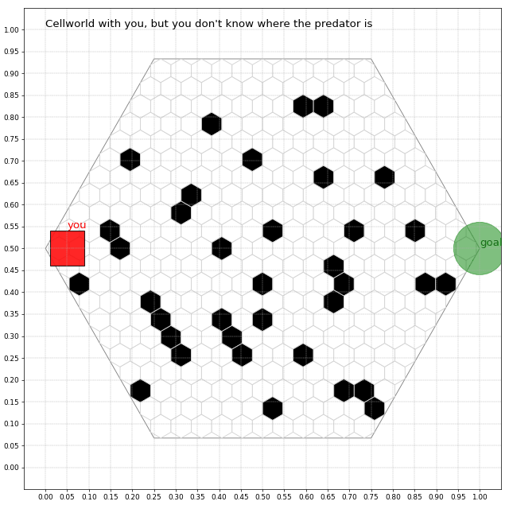
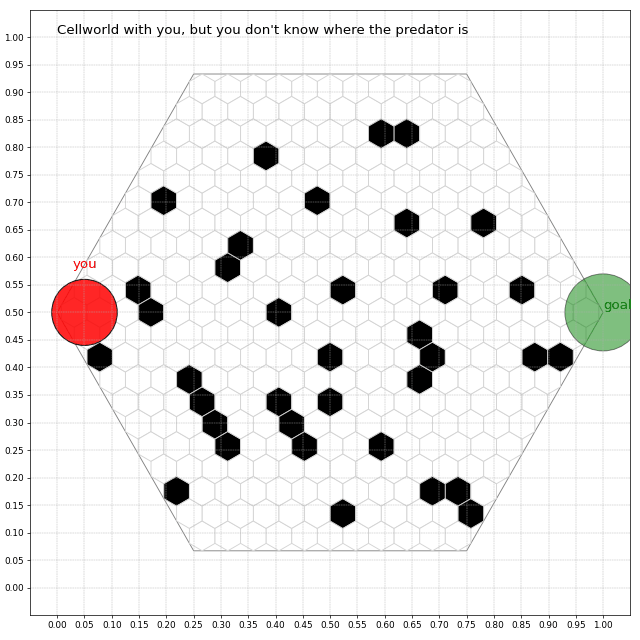
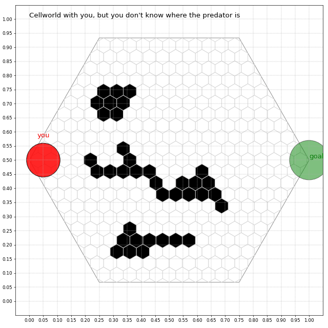
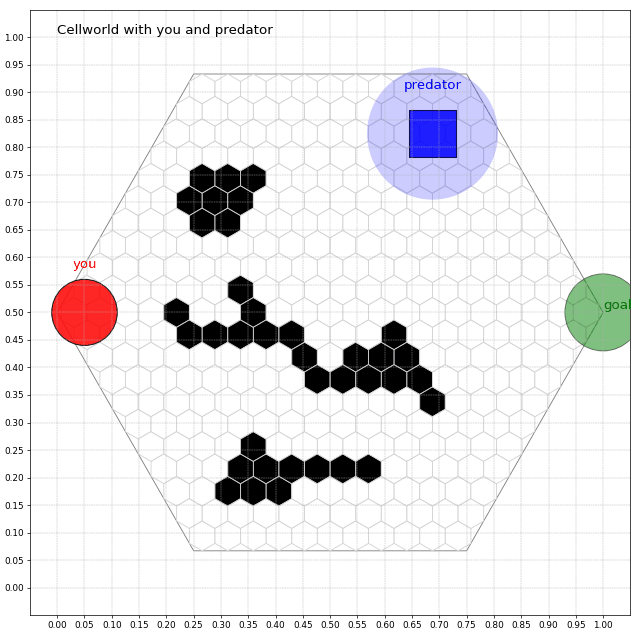

mamba activate /home/shv7753/pytorch-cuda-12-4

## Model Overview
- **LLaMA‑3 8B (text-only)** – first pass: the agent consumed structured textual descriptions of the arena and produced discrete moves.
- **GLM‑4.1V 9B Thinking (vision-language)** – second pass: same parameter scale, but now the model reads rendered frames directly for spatial reasoning.

## Episode GIF Gallery

### Episodes 1 – 6 · Baseline (circular icons)

### Episodes 10 – 20 · Shape-Differentiated Legends

### Episodes 30 – 39 · Clustered Map Experiments

